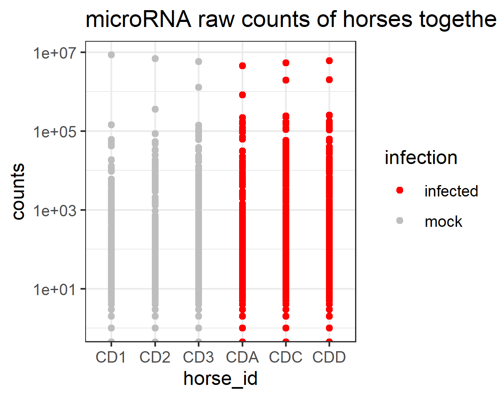

```{r setup, include=FALSE}
knitr::opts_chunk$set(
  results = 'asis',
  echo = FALSE,
  warning = FALSE,
  message = FALSE,
  fig.align = 'center'
)

#Load libraries
library(tidyverse)
library(kableExtra)

```


# Introduction
Introduce *Myself*. I am a virologist, and I am a postdoc in Australian Animal Health Laboratory (AAHL), CSIRO. My research projectS in AAHL are focusing on the identification of potential targets for anti-influenza drugs and therapeutics. By doing so, we will use CRISPR/Cas9 gene screening to find candidates that will inhibit virus replication. Therefore, I need to deal with big datasets when the screening results come back from next generation sequencing, which drives me to sign up for the data school training, and I believe this training will enable me to better analyse and visualise big datasets.  

# My Project
The data I used for My data school focus training has been published a few years ago, so no confidentiality issues will be involved. This dataset is from a project with microRNA raw counts with hosres infeted or mock infected with hendra virus.
The information of this published data can be found here: [info of data](https://www.nature.com/articles/s41598-017-06939-w)


## Preliminary results

The project I used for Data School training contains 2 raw data. One is metadata about horse information. The other csv data includes raw counts of 889 microRNAs from mock infected and hendra virus infected field horses.

**Tables**

```{r out.width='100%', include=FALSE}
knitr::opts_chunk$set(echo=FALSE)

read_csv("data/field_horses_metadata.csv")
field_horses_metadata <- read_csv("data/field_horses_metadata.csv")


read_csv("data/field_horses_raw_counts.csv")
field_horses_raw_counts <- read_csv("data/field_horses_raw_counts.csv")


field_horses_raw_counts_modified <- read_csv("data/field_horses_raw_counts_modified.csv")


field_horses_metadata_modified <- read_csv("data/field_horses_metadata_modified.csv")


tidy_field_horses_raw_counts <-  field_horses_raw_counts_modified %>%  
  gather(key = horse_id, value = counts, -gene) 


full_data <- full_join(tidy_field_horses_raw_counts, field_horses_metadata_modified)


```


```{r out.width='100%', echo=FALSE}
knitr::kable(head(field_horses_metadata, n = 6), format = "html", caption = "raw metadata") %>% 
  kable_styling("striped")

knitr::kable(head(field_horses_raw_counts, n = 6), format = "html", caption = "raw microRNA counts") %>% 
  kable_styling("striped")

knitr::kable(head(full_data, n = 6), format = "html", caption = "tidy up data of microRNA counts") %>% 
  kable_styling("striped")

```

**Raw counts of microRNAs of mock and hendra infected horses**

{width=500px}


**Overview of microRNA profile of horses**
```{r out.width='60%', fig.align='centre', fig.height= 4, fig.width=6, fig.cap="Overview of microRNA profile of horses"}

full_data %>%  ggplot (aes(x = horse_id,
                               y = counts, 
                                color = infection, 
                                group = horse_id))+
   geom_boxplot() + 
   geom_jitter()+
   scale_y_log10()+
   scale_color_manual(values = c(mock = "grey", infected = "red")) +
   theme_bw() +
   labs(title = "microRNA raw counts of field horses")

```
**MicroRNA profile with more than 10,000 counts"**

```{r out.width='60%', fig.align='centre', fig.height= 4, fig.width=6, fig.cap="MicroRNA profile > 10000 counts"}

raw_count_more_than_10000 <- full_data %>% 
  filter(counts > 10000)

raw_count_more_than_10000 %>% ggplot(aes(x = horse_id,
                    y = counts, 
                    color = infection, 
                    group = horse_id))+
  geom_boxplot() + 
  geom_jitter()+
  scale_y_log10()+
  scale_color_manual(values = c(mock = "grey", infected = "red")) +
  theme_bw() +
  labs(title = "microRNA raw counts more than 1000 of 6 horses")
```


**PCA analysis"**

```{r out.width='100%', include=FALSE}
field_horses_raw_counts_PCA <- field_horses_raw_counts %>% 
  column_to_rownames("gene") %>% 
  scale()


microRNA_PCA <- prcomp(field_horses_raw_counts_PCA)


summary(microRNA_PCA)
```

```{r out.width='60%', echo=FALSE, fig.align='centre', fig.height= 4, fig.width=6, fig.cap="MicroRNA_PCA"}
plot(microRNA_PCA)
```

# My Digital Toolbox

I have been using tidyverse and gglot2 to tidy up and visualize my data. Besides, I also try to do some statistical analysis with the dataset, such as student t test and PCA analysis. 

## Favourite tool 
My favorite tools are tidyverse and ggplot2. I can tidy up my data with tidyverse and then visualize my data with ggplot2. 

{.pull-right width=100px}

{width=100px}


# My time went ...

I spent quite a long time struggling with AAHL computer, as I need to ask for administration right every time I need to install any packages or liabrary. What is more frustrating is that I need to install packages and libraries every time I open RStudio. Therefore, I just gave up using AAHL computer and joined the data school trainning at home if I can. 

When I was trying to analysis my data, I spent a lot of time in tidy up and try to graph in different ways. I would like to invest more time on how to deal With big dataset such as microRNA sequencing results and next generation sequencing results, how to graph them in a more resonable way, and evetually perform scientific statistical analysis.


# Next steps

My next step would be learning how to analysis RNA seq results following some pipelines, generating graphs that make sense, and then analysis the data in a more scientific way, 

# My Data School Experience

I was hesitated to signed up for the Data School Training at the beginning since it requires a lot of time and commitment. But now I feel lucky that I actually joined the data school. The friendly atmosphere, professional Kerensa & Stephen, helpful mentors & helpers, lovely colleagues are essential for the success of this training. I enjoyed a lot! 

Now I have basic idea about R and RStudio, such as how to tidy up my data and visualise my data with ggplot, but I still need to invest more time and effort in R to become a little bit more professional! Hopefully, I will use all the skills I gained from data school into my future research projects!

I totally recommend this Data School Training to everyone, you will get more than what you expect!
